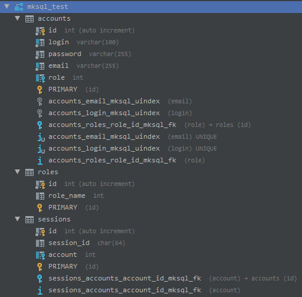
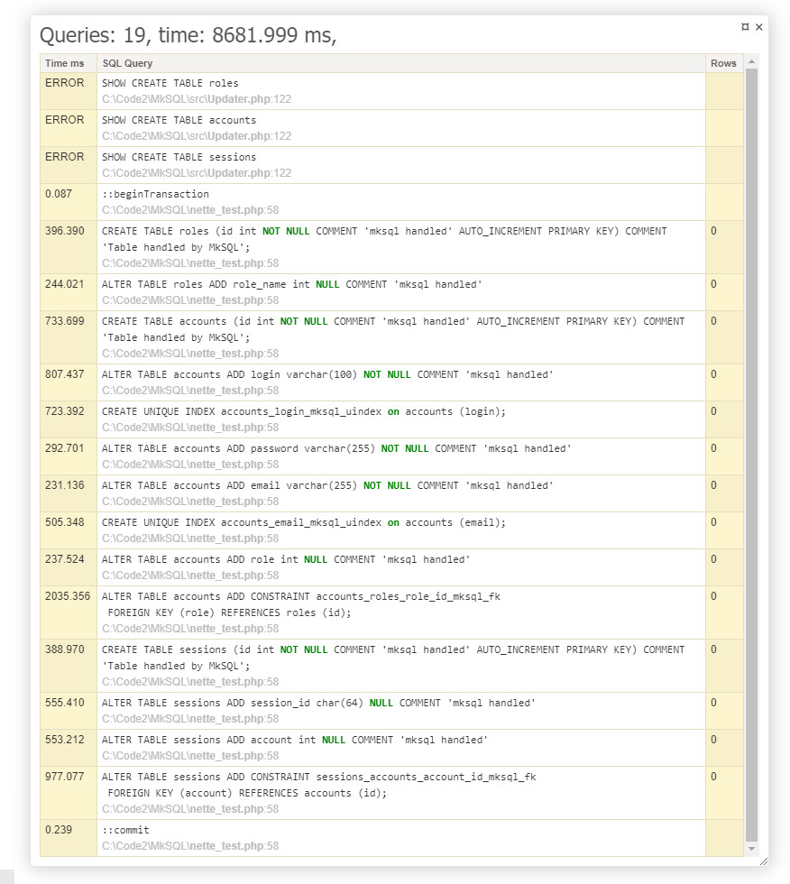
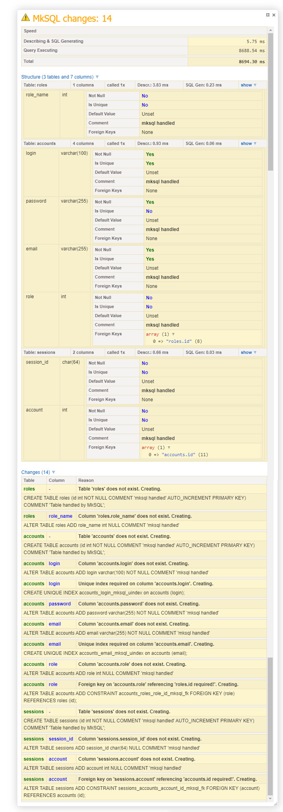
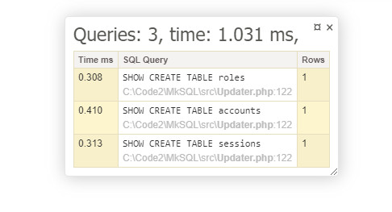
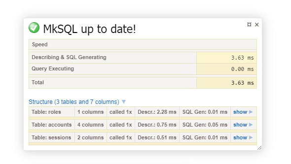
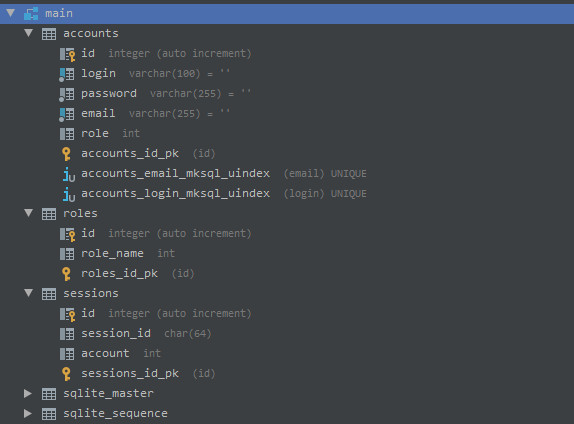
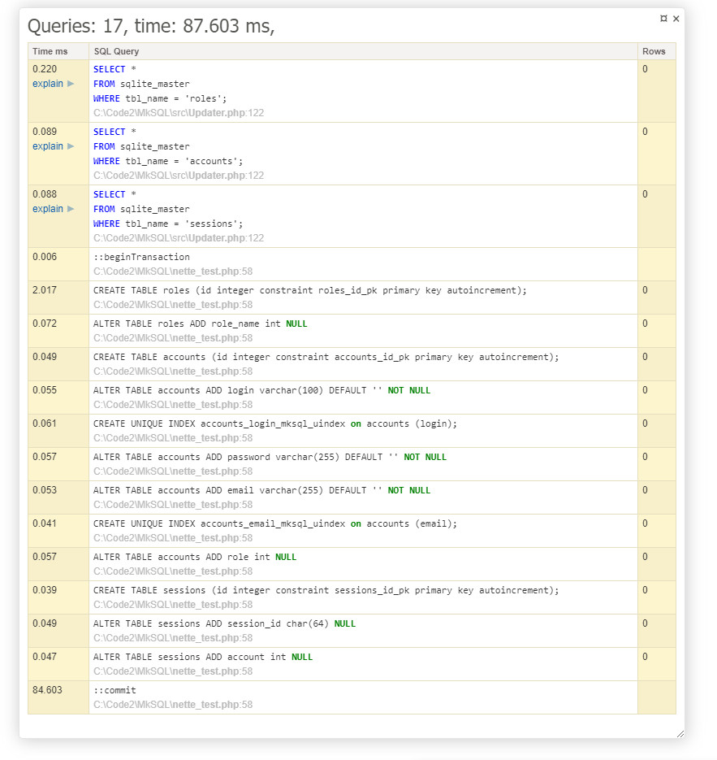
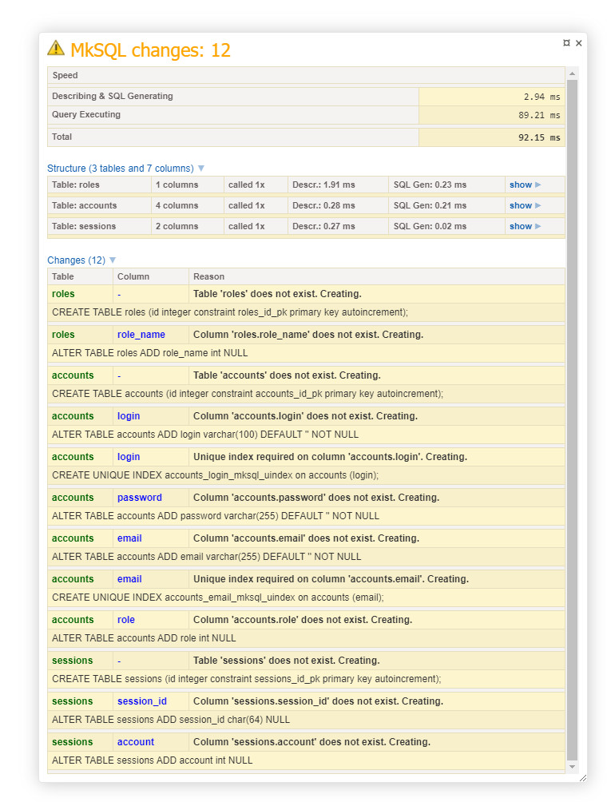
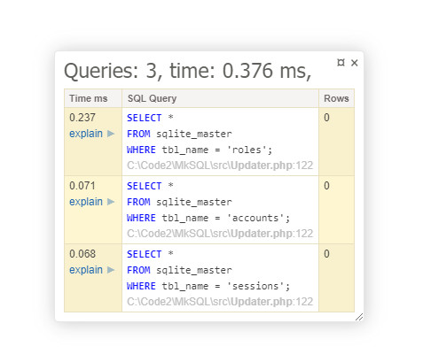
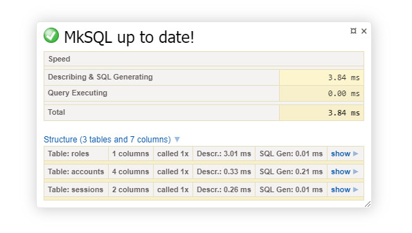

# MkSQL

**<span style="color:red;">Warning: </span> this package has no tests! Its like religion, you gotta believe!**

MkSQL is SQL tables AutoUpdater. Tables are defined in code, 
and MkSQL makes sure they are up to date.

This package is only creating and/or modifying tables and columns, it never deletes them!

##### Supported Drivers & Features: 

| Driver | Not Null | Default Value | Comments | Unique Index | Foreign Keys |
|---|---|---|---|---|---|
| MySQL | ✅ | ✅ | ✅ | ✅ | ✅ 
| SQLite | ✅ | ✅ | ❌ | ✅ | ❌  

 - no other drivers are supported (yet?)

### Installation

`composer require zrny/mksql`

This package is best served cold, with lime and by Dependency Injection.

It works with `\Nette\Database\Connection` and so it requires its 
instance OR database credentials like PDO;

###### Creating with Credentials
```php
$updater = new \Zrny\MkSQL\Updater('mysql:host=localhost;dbname=mksql','root','');
```
###### Creating with `Connection` instance:

```php
// We need connection from somewhere
$connection= new \Nette\Database\Connection('mysql:host=localhost;dbname=mksql','root','');
...
$updater = new \Zrny\MkSQL\Updater();
$updater->setConnection($connection);
```

###### Configuration for [Nette Framework](https://nette.org/)

 - Configuration
 
```neon
tracy:
    bar:
        - Zrny\MkSQL\Nette\TracyPanel

services:
    - Zrny\MkSQL\Updater
```

 - Then you can use prepared `MkSQLFactory` factory in your own factories.
 
```php
class ArticleRepositoryFactory
{
    private $connection;
    private $mksqlFactory;

    public function __construct(\Nette\Database\Connection $connection, \Zrny\MkSQL\MkSQLFactory $mksqlFactory)
    {
        $this->connection = $connection;
        $this->mksqlFactory = $mksqlFactory;
    }

    public function create()
    {
        return new ArticleRepository($this->connection,  $this->mksqlFactory->create());
    }
}
```
        
### Example

```php
$updater->table("roles")
    
        ->column("role_name")
        ->endColumn()
    
    ->endTable()

    ->table("accounts")
    
        ->column("login","varchar(100)")
            ->setNotNull()
            ->setUnique()
        ->endColumn()

        ->column("password", "varchar(255)")
            ->setNotNull()
        ->endColumn()
    
        ->column("email", "varchar(255)")
            ->setNotNull()
            ->setUnique()
        ->endColumn()
    
        ->column("role")
            ->addForeignKey("roles.id")
        ->endColumn()

    ->endTable()

    ->table("sessions")

        ->column("session_id","char(64)")
        ->endColumn()

        ->column("account")
            ->addForeignKey("accounts.id")
        ->endColumn()

    ->endTable()
    ->install();
```

##### Result in MySQL (creating):
 - Those speeds are from my personal machine, not from a real server!

###### Php Storm Connection Panel

 

###### Connection

 

###### Tracy Panel

 

##### Result in MySQL (check):

###### Connection

 

###### Tracy Panel

 

##### Result in SQLite (creating):

###### Php Storm Connection Panel

 

###### Connection

 

###### Tracy Panel

 

##### Result in SQLite (check):

###### Connection

 

###### Tracy Panel

 


