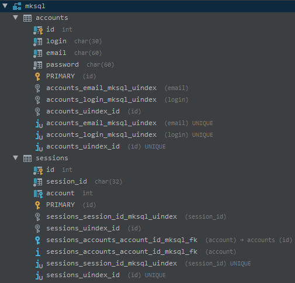

# MkSQL 

**<span style="color:red;">Warning: </span> this package has no tests!**

This package is AutoUpdater for your MySQL database tables. You define tables 
in the code, and the table structure will be Up2Date.
 
Is only creates table and makes sure they fit the description you defined, 
this code never deletes a table or column if you remove it from definition. 
 
Currently only suported drivers are:
- mysql

Planned drivers to implement:
- sqlite 

This package has [nette/database ^3.0.6](https://github.com/nette/database) as a dependency and requires `PHP >=7.1` with `ext-pdo` installed!


# Usage

### Initialization:

This package internally uses `nette/database` and
it requires connection details like PDO. MkSQL is best 
served cold, with lime and by Dependency Injection.


###### Manual Initialization:

```php
$updater = new \Zrny\MkSQL\Updater('mysql:host=localhost;dbname=mksql','root','');
```

###### Initialization with Nette Framework:

This example is usage with [Nette Framework](https://nette.org/), but I think its similar with other frameworks.

Register service in configuration file: (database credentials expected in `parameters` section)
```neon
services:
    - Zrny\MkSQL\Updater(%database.dsn%,%database.user%,%database.password%)      
``` 

Then you for example use it in model factory...

```php  
<?php

namespace \Model\Article;

class ArticleRepositoryFactory
{    
    private $db;
    private $mksql;

    public function __construct(Connection $db, Updater $mksql)
    {
        $this->db = $db;
        $this->mksql = $mksql;
    }

    public function create(int $id)
    {
        return new ArticleRepository($id, $db, $mksql)
    }
}
```

###### Code:

If you think that class `\Zrny\MkSQL\Column` is missing `->setPrimary()` method to create primary keys,
then notice that every table created with MkSQL have primary key `id` 
that is `int` & `AUTO INCREMENT` by default and this behavior cannot 
be changed, trying to define column `id` will result in error.

Example with accounts ant their corresponding auth tokens: 

```php   
 $updater->table("accounts")

        ->column("login","char(30)")
            ->setUnique()
            ->setNotNull() 
        ->endColumn()

        ->column("email","char(60)")
            ->setUnique()
            ->setNotNull()
        ->endColumn()

        ->column("password", "char(60)")
            ->setNotNull()
        ->endColumn()

    ->endTable()

    ->table("sessions")

        ->column("session_id","char(32)")
            ->setComment("SHA 128bit Key")
            ->setUnique()
            ->setNotNull()
        ->endColumn()

        ->column("account"/*, "int"*/) //Type is "int" by default
            ->addForeignKey("accounts.id")
        ->endColumn()

    ->endTable();
   
    $updater->install(); 
```

This code will result in this:



###### Speed Examples:
 
*Both speeds are from my machine.*

Example installation speed when the database is empty:

    8368.80589ms
        
Example speed when the database is created and configured:

    6.91795ms 