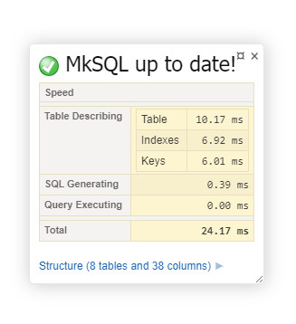
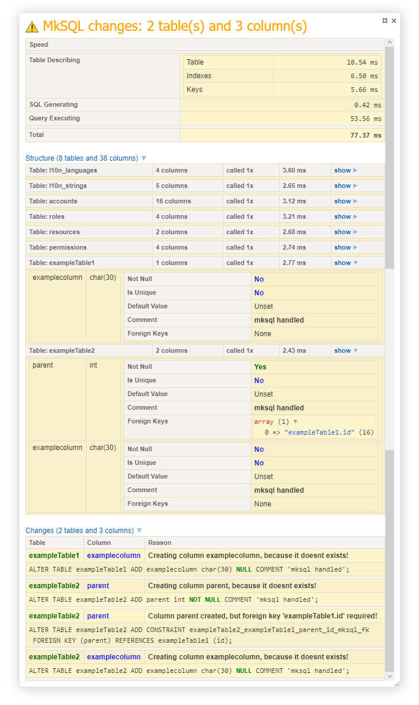

# MkSQL 

 - **Version 0.3.0 notice** - Rewriten SQL generating part, speed improved by >50%. 
 All table properties are parsed from `SHOW CREATE TABLE tablename` as `INFORMATION_SCHEMA` 
 are very slow, and it calls only one query to describe whole table instead of three.
  (`SHOW FULL COLUMNS FROM tablename` & `SHOW INDEXES FROM tablename` can be 
   parsed from `SHOW CREATE TABLE` too)

**<span style="color:red;">Warning: </span> this package has no tests!**

This package is AutoUpdater for your MySQL database tables. You define tables 
in the code, and the table structure will be Up2Date.
 
Is only creates table and makes sure they fit the description you defined, 
this code never deletes a table or column if you remove it from definition. 
 
Currently only suported drivers are:
- mysql

Planned drivers to implement:
- sqlite  

# Usage

### Initialization:

This package internally uses `nette/database` and
it requires connection details like PDO. MkSQL is best 
served cold, with lime and by Dependency Injection.


###### Manual Initialization with Credentials:

```php
$updater = new \Zrny\MkSQL\Updater('mysql:host=localhost;dbname=mksql','root','');
```


###### Manual Initialization from `Nette\Database\Connection` object:

```php
$connection= new \Nette\Database\Connection('mysql:host=localhost;dbname=mksql','root','');

...

$updater = new \Zrny\MkSQL\Updater();
$updater->setConnection($connection);
```

###### Initialization with [Nette Framework](https://nette.org/):

Register service in configuration file:
```neon
services:
    - Zrny\MkSQL\Updater  
```

Tracy Panel was added, you can register it like this:
(Example panel can be seen at the bottom of this readme.)

```neon
tracy:
    bar:
        - Zrny\MkSQL\Nette\TracyPanel

```

Then you update your factories:

You need to provide connection in your factory this way. 
Or, you can create Updater factory and provide database connection 
there.

```php  
class ArticleRepositoryFactory
{
    private $db;
    private $mksql;

    public function __construct(\Nette\Database\Connection $db, \Zrny\MkSQL\Updater $mksql)
    {
        $mksql->setConnection($db);
        $this->db = $db;
        $this->mksql = $mksql;
    }

    public function create()
    {
        return new ArticleRepository($this->db,  $this->mksql);
    }
}
```

And **make sure** you run it **only once** in the repository:

```php 
class ArticleRepository
{
    private $db;

    public function __construct(\Nette\Database\Connection $db, \Zrny\MkSQL\Updater $updater)
    {
        $this->db = $db;
        $this->initializeDatabase($updater);
   
    }

    //Run only once!
    private static $ArticleTablesChecked = false;
    public function initializeDatabase(\Zrny\MkSQL\Updater $updater)
    {
        if(static::$ArticleTablesChecked === false)
        {              
            $updater->table("article")
                ->column("content","longtext")
                    // ...
                ->endColumn()
            ->endTable()->install();
            static::$ArticleTablesChecked = true;
        }
    }
    
    // ...
}
``` 

###### Code:

Keep in mind that every table automatically gets `PRIMARY` column `id` 
as `int` and `AUTO INCREMENT`, trying to define column `id` will 
result in error.
 
This package does not support **Composite Primary Key**s

```php   
 $updater->table("accounts")

        ->column("login","char(30)")
            ->setUnique()
            ->setNotNull() 
        ->endColumn()

        ->column("email","char(60)")
            ->setUnique()
            ->setNotNull()
        ->endColumn()

        ->column("password", "char(60)")
            ->setNotNull()
        ->endColumn()

    ->endTable()

    ->table("sessions")

        ->column("session_id","char(32)")
            ->setComment("SHA 128bit Key")
            ->setUnique()
            ->setNotNull()
        ->endColumn()

        ->column("account"/*, "int"*/) //Type is "int" by default
            ->addForeignKey("accounts.id")
        ->endColumn()

    ->endTable();
   
    $updater->install(); 

    /*
     * or '->endTable()->install();'
     */

```

This code will result in this:


###### Tracy Bar Example
 


