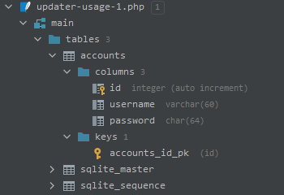
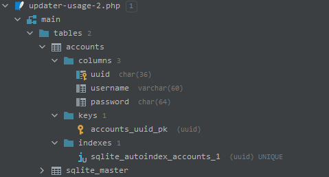
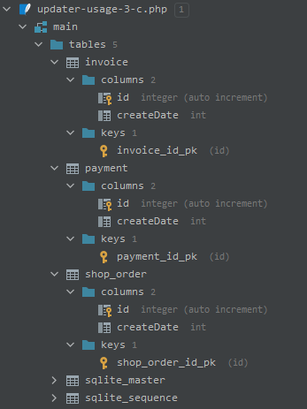
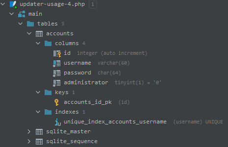
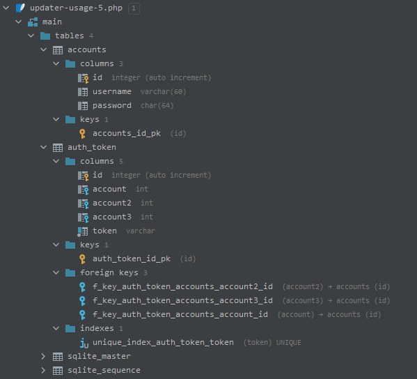

# Updater usage

You can use updater as a standalone object for creating database tables.

Let's create a simple table for account, with `username` and `password`:

```php
// File: /examples/updater-usage-1.php
use Zrnik\MkSQL\Updater;

include __DIR__ . '/../vendor/autoload.php';

$pdo = new PDO('sqlite:' .  __FILE__ . '.sqlite3');
$updater = new Updater($pdo);

$a = $updater->tableCreate('accounts');
$a->columnCreate('username', 'varchar(60)');
$a->columnCreate('password', 'char(64)'); // sha256 result

$a->setPrimaryKeyType("char(36)");

$updater->install();
```

And it's done! You now have an accounts table.
It will look like this:



***Wow*, where did the `id` column came from?**

Table primary key is automatically generated for you. You can 
modify its type and name with `$table->setPrimaryKeyName("newPkColumnName");`
and `$a->setPrimaryKeyType("char(36)"); // uuid?` methods. 

Example:
```php
// File: /examples/updater-usage-2.php
use Zrnik\MkSQL\Updater;

include __DIR__ . '/../vendor/autoload.php';

$pdo = new PDO('sqlite:' .  __FILE__ . '.sqlite3');
$updater = new Updater($pdo);

$a = $updater->tableCreate('accounts');
$a->setPrimaryKeyName('uuid');
$a->setPrimaryKeyType('char(36)');
$a->columnCreate('username', 'varchar(60)');
$a->columnCreate('password', 'char(64)'); // sha256 result

$updater->install();
```

Result:



**Composite primary keys** are not, and will not be supported. First, 
I have no idea what is the use for them and second, I don't have a
slight idea how it could be implemented.

## Column cloning

What if you want to have more tables with the same column definition?
It might tempt you to write it like this:

```php
// File: /examples/updater-usage-3-w.php
use Zrnik\MkSQL\Updater;

include __DIR__ . '/../vendor/autoload.php';

$pdo = new PDO('sqlite:' .  __FILE__ . '.sqlite');
$updater = new Updater($pdo);

$multipleTableColumn = new \Zrnik\MkSQL\Column('createDate', 'int' /* 'int' is actually default value */);

$o = $updater->tableCreate('shop_order');
$p = $updater->tableCreate('payment');
$i = $updater->tableCreate('invoice');

$o->columnAdd($multipleTableColumn); // This is ok, and '$multipleTableColumn' will get '$o' table as parent.
$o->columnAdd($multipleTableColumn); // Error and the execution ends because '$multipleTableColumn' already has a parent
$o->columnAdd($multipleTableColumn); // You will not get here...

$updater->install();
```

Result:
```
LogicException: Column 'createDate' already has a parent 'shop_order', consider cloning!
```

To correctly use single column definition for multiple tables, do it like this:

```php
// File: /examples/updater-usage-3-c.php
use Zrnik\MkSQL\Updater;

include __DIR__ . '/../vendor/autoload.php';

$pdo = new PDO('sqlite:' .  __FILE__ . '.sqlite');
$updater = new Updater($pdo);

$multipleTableColumn = new \Zrnik\MkSQL\Column('createDate', 'int' /* 'int' is actually default value */);

$o = $updater->tableCreate('shop_order');
$p = $updater->tableCreate('payment');
$i = $updater->tableCreate('invoice');

$o->columnAdd($multipleTableColumn);
$p->columnAdd(clone $multipleTableColumn); //Cloning will create NEW instance of the column
$i->columnAdd(clone $multipleTableColumn); // and REMOVES the parent from it.

$updater->install();
```

Result: 



## Column properties

You can define more stuff to the column. For example:
- NOT NULL
- Unique Index
- Default Value
- Comment

We can do it like this:

```php
// File: /examples/updater-usage-4.php
use Zrnik\MkSQL\Updater;

include __DIR__ . '/../vendor/autoload.php';

$pdo = new PDO('sqlite:' .  __FILE__ . '.sqlite');
$updater = new Updater($pdo);

$a = $updater->tableCreate('accounts');

// Username must be set and must be unique
$a->columnCreate('username', 'varchar(60)')
    ->setNotNull()->setUnique();

// Passwords should not be null, and I guess they will be unique
// by design, so I don't care about unique index.
// We also comment what algo is used to generate it... (no effect in SQLite)
$a->columnCreate('password', 'char(64)')
    ->setNotNull()->setComment('sha256 value');

// You don't need to set 'administrator' value when creating a row,
// and we definitely want ordinary user NOT to be administrators!
$a->columnCreate('administrator', 'tinyint(1)')
    ->setNotNull()->setDefault(0);

$updater->install();
```

Result: 



## Foreign Key

Foreign key support is limited, you should aim the foreign key at
another table's primary key, and it will constrain in from actions
that would break the link. You cannot (yet?) change 
`ON DELETE` and `ON UPDATE` behavior, so the default
is used. 

For example, can link authentication token to the account like this:

```php
// File: /examples/updater-usage-5.php
use Zrnik\MkSQL\Updater;

include __DIR__ . '/../vendor/autoload.php';

$pdo = new PDO('sqlite:' .  __FILE__ . '.sqlite');
$updater = new Updater($pdo);

$a = $updater->tableCreate('accounts');
$a->columnCreate('username', 'varchar(60)');
$a->columnCreate('password', 'char(64)');

$t = $updater->tableCreate('auth_token');
$t->columnCreate('account')
    ->addForeignKey('accounts.id');

// Or you can (and should) use properties of the table we are aiming at:
$t->columnCreate('account2', $a->getPrimaryKeyType())
    ->addForeignKey(sprintf('%s.%s', $a->getName(), $a->getPrimaryKeyName()));

// this can be achieved with 'addForeignTable' method:
$t->columnCreateForeign('account3', $a);

$t->columnCreate('token', 'varchar')
    ->setUnique();

$updater->install();
```

Result: 



I guess that's everything that relates to the updater itself, you can continue to [Factory Usage & Installable Class](usage-factory-installable.md) page.


